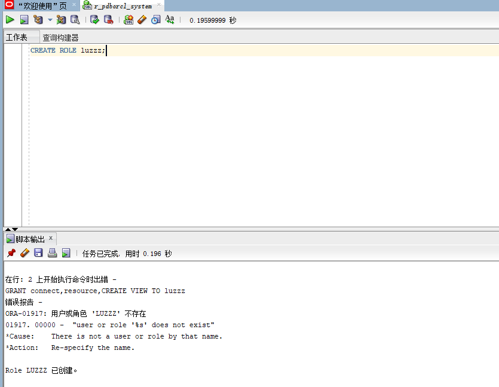
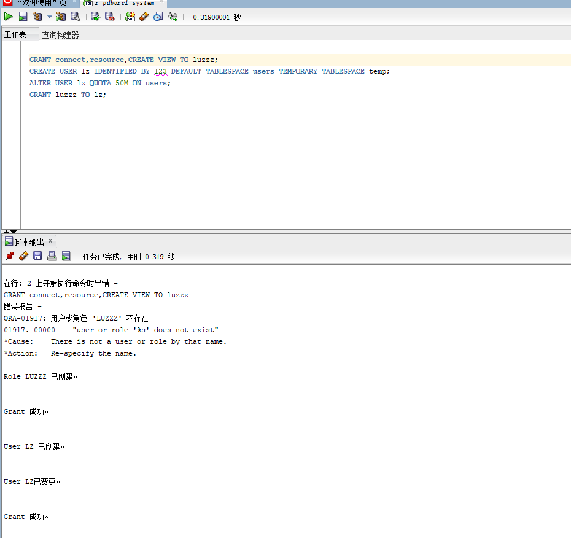
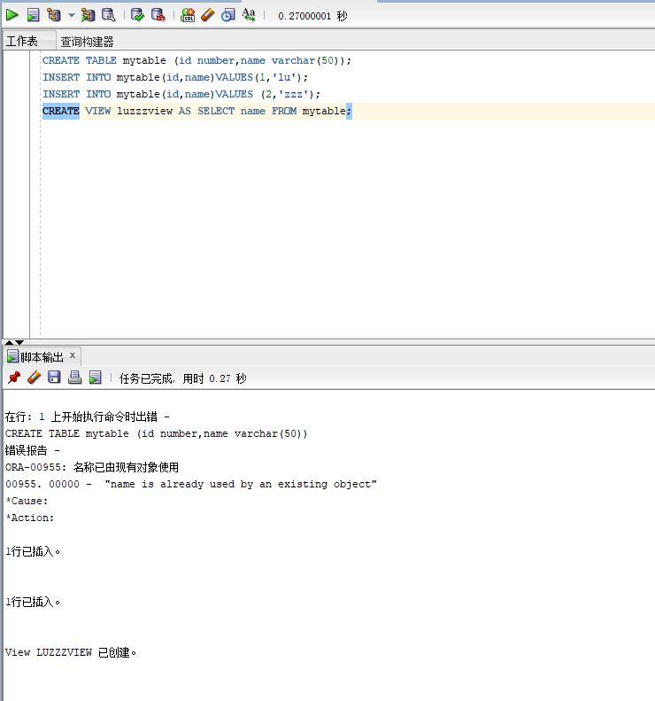
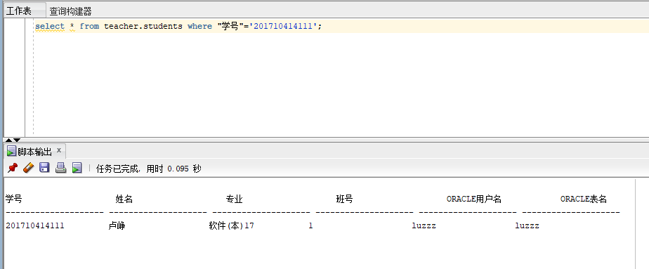

#### 以system登录创建角色
```sql
CREATE ROLE luzzz;
GRANT connect,resource,CREATE VIEW TO luzzz;
CREATE USER lz IDENTIFIED BY 123 DEFAULT TABLESPACE users TEMPORARY TABLESPACE temp;
ALTER USER lz QUOTA 50M ON users;
GRANT luzzz TO lz;
```
实验截图：



#### 新用户连接，创建表和视图
```sql
show user;
CREATE TABLE mytable (id number,name varchar(50));
INSERT INTO mytable(id,name)VALUES(1,'lu');
INSERT INTO mytable(id,name)VALUES (2,'zzz');
CREATE VIEW luzview AS SELECT name FROM mytable;
SELECT * FROM lkview;
```
实验截图：


#### 授权


#### 信息插入
```sql
select * from teacher.students where "学号"='201710414111';
update teacher.students set "ORACLE用户名" ='lz',"ORACLE表名"=''mytable where "学号"='201710414119';
```
实验截图：
