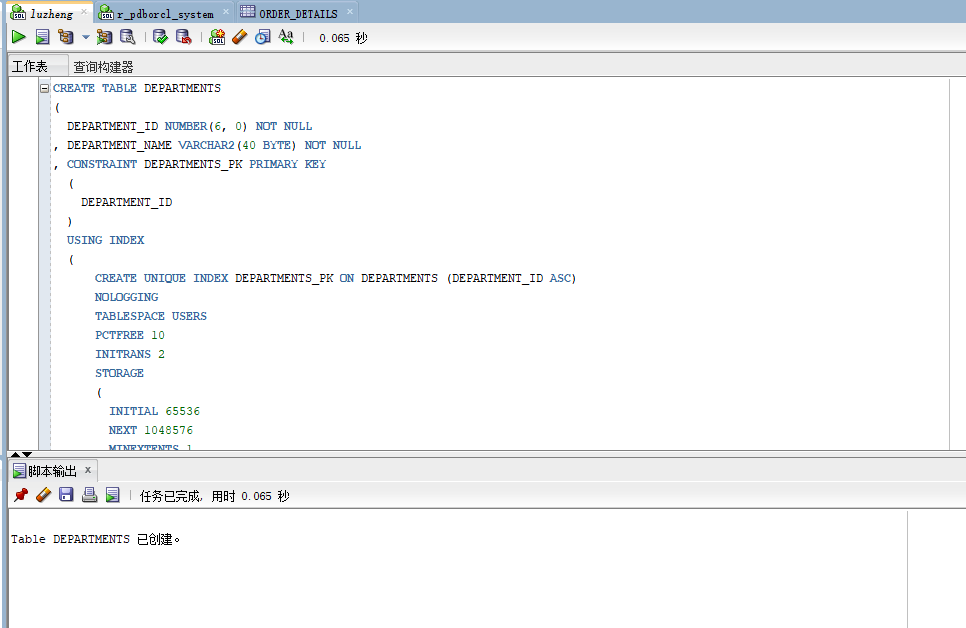
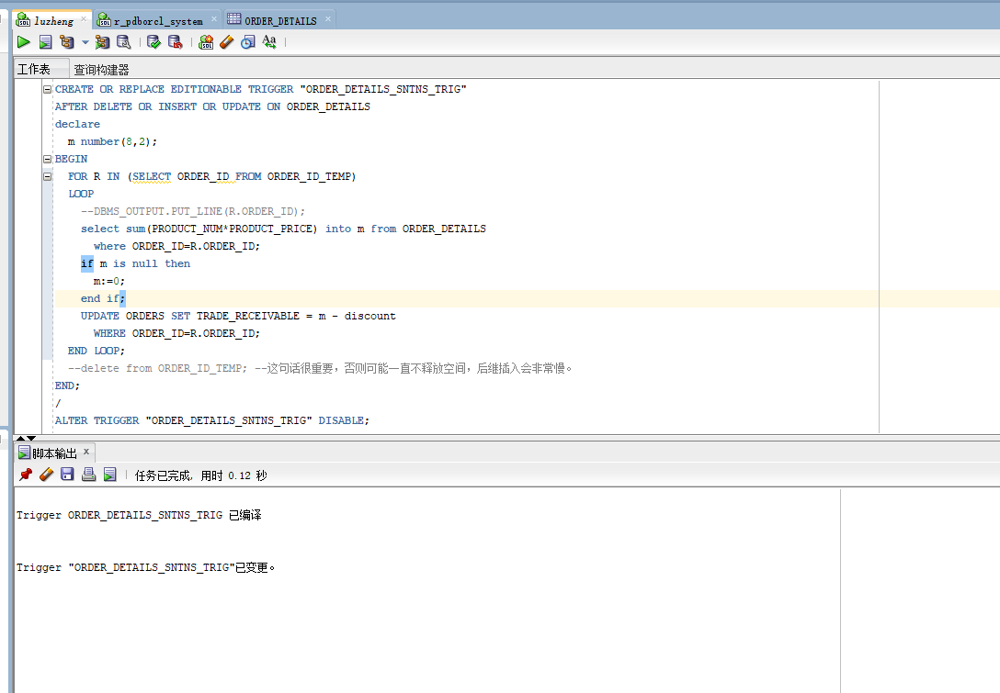
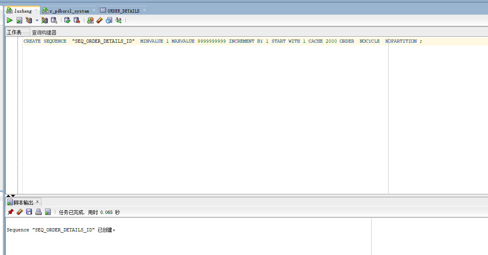
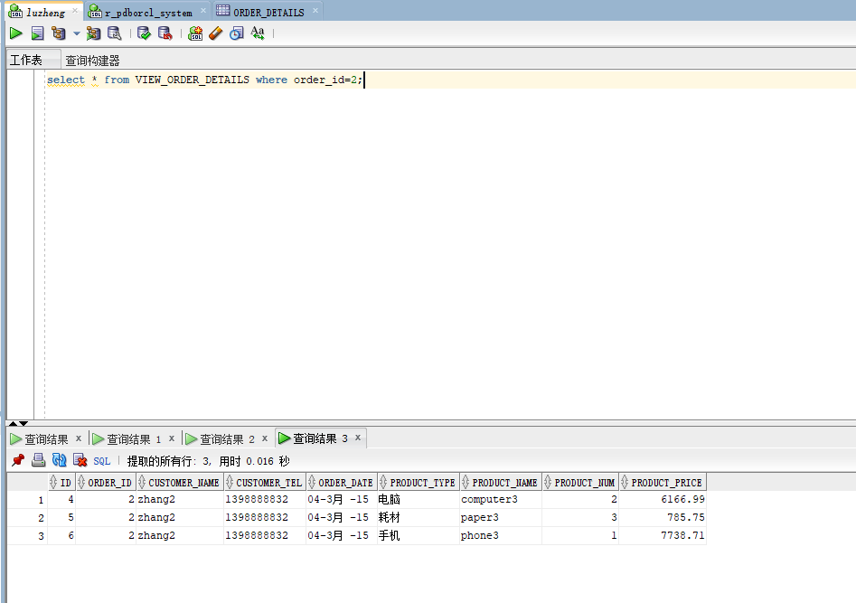

#  实验四

### 在实验三时创建user02的分区以及给luzheng授权

### 创建DEPARTMENTS表，PRODUCTS表，EMPLOYEES表，ORDERS表，ORDER_DETAILS表

;
;
;
;
;
;
;

### 创建触发器

;
;
;
;
;
;
;
;
;

### 向表中插入数据

;
;
;
;

### 查询数据

####  1.查询某个员工的信息
;

####  2.递归查询某个员工及其所有下属，子下属员工。
;

####  3.查询订单表，并且包括订单的订单应收货款: Trade_Receivable= sum(订单详单表.ProductNum*订单详单表.ProductPrice)- Discount。
;

####  4.查询订单详表，要求显示订单的客户名称和客户电话，产品类型用汉字描述。
;

####  5.查询出所有空订单，即没有订单详单的订单。
;

####  6.查询部门表，同时显示部门的负责人姓名。
;
