<p align="center"></p>
<p align="center"><strong>期末项目设计报告</strong></p>
<table align="center">
<tbody>
<tr>
<td width="212">
<p>题&nbsp;&nbsp;&nbsp;&nbsp;目</p>
</td>
<td colspan="3" width="496">
<p>基于Oracle的服装店管理系统的数据库设计</p>
</td>
</tr>
<tr>
<td width="212">
<p>课程</p>
</td>
<td colspan="3" width="496">
<p>Oracle数据库应用</p>
</td>
</tr>
<tr>
<td width="212">
<p>学&nbsp;&nbsp;&nbsp;&nbsp;院</p>
</td>
<td colspan="3" width="496">
<p>信息科学与工程学院</p>
</td>
</tr>
<tr>
<td width="212">
<p>专&nbsp;&nbsp;&nbsp;&nbsp;业</p>
</td>
<td width="201">
<p>软件工程</p>
</td>
<td width="106">
<p>年级</p>
</td>
<td width="189">
<p>2017级</p>
</td>
</tr>
<tr>
<td width="212">
<p>学生姓名</p>
</td>
<td width="201">
<p>卢峥</p>
</td>
<td width="106">
<p>学号</p>
</td>
<td width="189">
<p>201710414111</p>
</td>
</tr>
<tr>
<td width="212">
<p>指导教师</p>
</td>
<td width="201">
<p>赵卫东</p>
</td>
<td width="106">
<p>职称</p>
</td>
<td width="189">
<p>副教授</p>
</td>
</tr>
</tbody>
</table>
<p>&nbsp;</p>
<table align="center">
<tbody>
<tr>
<td width="118">
<p><strong><strong>评分项</strong></strong></p>
</td>
<td width="460">
<p><strong><strong>评分标准</strong></strong></p>
</td>
<td width="59">
<p><strong><strong>满分</strong></strong></p>
</td>
<td width="59">
<p><strong><strong>得分</strong></strong></p>
</td>
</tr>
<tr>
<td width="118">
<p>文档整体</p>
</td>
<td width="460">
<p>文档内容详实、规范，美观大方</p>
</td>
<td width="59">
<p>10</p>
</td>
<td width="59">
<p>&nbsp;</p>
</td>
</tr>
<tr>
<td width="118">
<p>表设计</p>
</td>
<td width="460">
<p>表，表空间设计合理，数据合理</p>
</td>
<td width="59">
<p>20</p>
</td>
<td width="59">
<p>&nbsp;</p>
</td>
</tr>
<tr>
<td width="118">
<p>用户管理</p>
<p>&nbsp;</p>
</td>
<td width="460">
<p>权限及用户分配方案设计正确</p>
</td>
<td width="59">
<p>10</p>
</td>
<td width="59">
<p>&nbsp;</p>
</td>
</tr>
<tr>
<td width="118">
<p>PL/SQL设计</p>
</td>
<td width="460">
<p>存储过程和函数设计正确</p>
</td>
<td width="59">
<p>25</p>
</td>
<td width="59">
<p>&nbsp;</p>
</td>
</tr>
<tr>
<td width="118">
<p>备份方案</p>
</td>
<td width="460">
<p>备份方案设计正确</p>
</td>
<td width="59">
<p>25</p>
</td>
<td width="59">
<p>&nbsp;</p>
</td>
</tr>
<tr>
<td width="118">
<p>容灾方案</p>
</td>
<td width="460">
<p>DataGuard设计正确</p>
</td>
<td width="59">
<p>10</p>
</td>
<td width="59">
<p>&nbsp;</p>
</td>
</tr>
<tr>
<td colspan="3" width="637">
<p><strong><strong>得分合计</strong></strong></p>
</td>
<td width="59">
<p>&nbsp;</p>
</td>
</tr>
</tbody>
</table>
<p align="center">2019&nbsp;年 &nbsp;11&nbsp;&nbsp;月 &nbsp;18&nbsp;日</p>


# 第1章．系统概述

        随着人们生活水平的提高，品牌服装越来越受到人们的青睐。但是，很多专卖店仍然采用落后的人工管理方式。这种状况对提高整个专卖店的管理水平、市场预测和辅助决策等带来了负面影响。

        本数据库应用系统是针对县区专卖店的实际需求开发设计的，利用计算机运算速度快、存储信息容量大、处理逻辑问题强、功能强大的优势，从专卖店的服装订购、进库、销售、店员管理等实际需求出发，针对性强，功能齐备，旨在通过帮助专卖店服装管理实 现信息化，以提高专卖店管理的效率。


        随着人们生活水平的提高，品牌服装越来越受到人们的青睐。但是，很多专卖店仍然采用落后的人工管理方式。这种状况对 提高整个专卖店的管理水平、市场预测和辅助决策等带来了负面影响。 本数据库应用系统是针对县区专卖店的实际需求开发设计的，利用计算机运算速度快、存储信息容量大、处理逻辑问题强、功 能强大的优势，从专卖店的服装订购、进库、销售、店员管理等实际需求出发，针对性强，功能齐备，旨在通过帮助专卖店服装管理实现信息化，以提高专卖店管理的效率。通过服装专卖店管理系统数据库的设计与实现的具体实践，把软件工程的原理和方法应用到数据库系统的设计中来，简单的开发了数据库。


# 第2章．业务流程
        业务流程，是为达到特定的价值目标而由不同的人分别共同完成的一系列活动。活动之间不仅有严格的先后顺序限定，而且活动的内容、方式、责任等也都必须有明确的安排和界定，以使不同活动在不同岗位角色之间进行转手交接成为可能。活动与活动之间在时间和空间上的转移可以有较大的跨度。而狭义的业务流程，则认为它仅仅是与客户价值的满足相联系的一系列活动。

        在本服装实体店管理系统中，结合着实际情况以及网上考察借鉴，整个的业务流程可以大致分为三部分。仓库的商品库存管理，导购员分配管理，客户购买订单管理。

    （1）仓库的商品库存管理。无论什么行业，你出售或者售卖的商品永远是重中之重，没有了商品就没有了立足之本，一切都没有意义。所以商品的库存管理也是整个服装实体店管理系统的重中之重。在购进商品时，我们会保留商品的进价以及售价，并在数据库里创建该商品的商品ID，在购进时同时将商品的分类信息保存在商品表里。在通过库存表将商品的数量，存储位置，以及最新的存取时间保存。库存表和商品表是一对一的关系。

    （2）导购员分配管理。整个服装店根据商品类型分为不同的分区。每个分区有各自的负责人和若干导购员。客户进入到某个分区，就会有该分区的导购员进行讲解和引导。帮助客户修购选购商品。

    （3）客户购买订单管理。客户进入店里，选择商品并支付成功后，生成本次订单，每次订单都有唯一的订单ID。

整体ER图
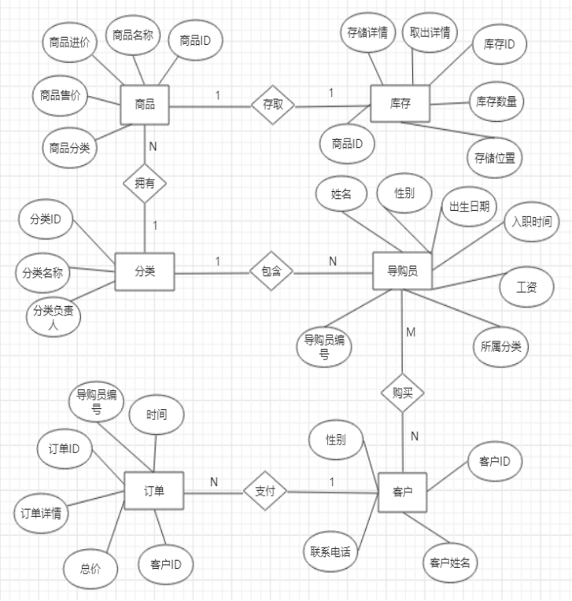

# 第3章. 实体分析
## 3.1实体模型
    根据上述业务流程分析，一共有6个实体，分别为：商品，库存，分区，导购员，客户，订单。


    （1）商品(commodity):商品ID(commodity_id)，商品名称(commodity_name)，商品进价(commodity_price)，商品售价(commodity_sellPrice)，商品分类(commodity_class);

    
    （2）库存（stock）：商品编号（commodity_id），库存ID(stock_id)，商品数量(size)，存储位置(position)，存储详情(store_info)，取出详情(take_info)，

  
    （3）分类（class）：分类ID(class_id)，分类名称(class_name)，分类负责人(class_headPerson)。
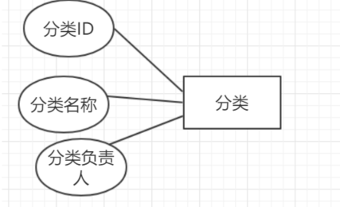
  
    （4）导购员(shopGuide)：导购员编号(shopGuide_id)，导购员姓名(shopGuide_name)，导购员性别(shopGuide_sex)，导购员出生日期(shopGuide_brithday)。导购员入职时间(shopGuide_entryTime)，导购员所属分类(class_id)，工资(wages)。

  
    （5）客户（customer）：客户ID(customer_id)，客户性别(customer_sex)，联系电话(customer_phone)，客户姓名(customer_name)，订单编号(order_id)，导购员编号（shopGuide_id）。
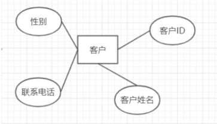
  
    （6）订单(order)：时间(order_time)，订单ID(order_id)，订单详情(order_info)，订单总价(order_price)，客户ID(customer_id)，导购员编号（shopGuide_id）。
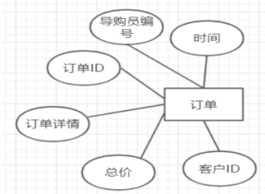
  
## 3.2 实体联系模型
    （1）商品品需要在经过库存里面进行存储或取出。
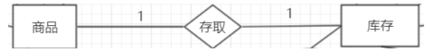
  

    （2）一个分类拥有多个商品

  
    （3）一个分类拥有多个导购员

  
    （4）导购员与客户应是多对多的关系

  
    （5）一个客户应该拥有多个订单

  


# 第4章 数据表的设计

## （1）商品表
    商品表（commodity）

属性名|数据类型|是否为空|主键/外键|取值范围
:-: | :-: | :-: | :-: | :-:
commodity_id | char(5) | 否 | 主键| 
commodity_name | char(20) | 否| 	
class_id | char(8) | 否 | 外键| 	
commodity_price | float | 否 ||大于零| 
commodity_sellprice | float | 否 | |大于零| 

## （2）商品库存表
    商品库存表（stock）

属性名|数据类型|是否为空|主键/外键|取值范围
:-: | :-: | :-: | :-: | :-:
stock_id|char(5)|否|主键	
commodity_id|char(5)|否|外键	
size|char(10)			
position|char(20)			
store_info|char(10)			
take_info|char(10)			

## （3）商品分类表
    商品分类表（class）
属性名	|数据类型 |是否为空	| 主键/外键|	取值范围
:-: | :-: | :-: | :-: | :-:
class_id|char(5)	|否	|主键	
class_name	|char(10)	|否		
class_headperson	|char(5)	|否		

## （4）导购员表
    导购员表（shopGuide）
属性名|数据类型|	是否为空	|主键/外键	|取值范围
:-: | :-: | :-: | :-: | :-:
shopGuide_id	|char(10)|	否	|主键	
shopGuide_name	|char(10)|	否		
shopGuide_sex	|char(5)|	否		|男，女
shopGuide_brithday	|char(5)			
shopGuide_entryTime	|char(10)	|否		
class_id	|char(5)	|否	|外键	
wages	|float			

## （5）客户表
    客户表（customer）
属性名	| 数据类型	| 是否为空	| 主键/外键| 	取值范围
:-: | :-: | :-: | :-: | :-:
customer_id	char(10)|否	|主键	
customer_name	|char(15)|	否		
customer_sex	|char(5)|			
customer_phone	|char(15)|			

## （6）订单表
    订单表（order）
属性名	|数据类型|是否为空| 主键/外键|	取值范围
:-: | :-: | :-: | :-: | :-:
order_id|char(10)	|否	|主键	
order_time	|char(10)	|否		
order_price	|char(5)	|否		
order_info	|char(15)	|		
cusomer_id	|char(10)	|	外键	
shopGuide_id	|char(10)	|	外键	

# 第五章创建pdb数据库，表空间，表，以及用户
## 5.1 创建pdb数据库以及管理员
    创建了一个名叫lzpdb的数据库，指定了它的存储位置，以及创建了数据库lzpdb的管理员，具体sql如下

``` sql
create pluggable database lzpdb admin user lz identified by 123 file_name_convert=
('/home/oracle/app/oracle/oradata/orcl/pdbseed/',
' /home/oracle/app/oracle/oradata/orcl/lzpdb');
```
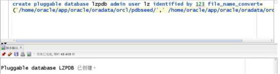
  

    重启虚拟机后使得刚才创建的lzpdb数据库open，并给创建的lz管理员授予lzpdb的最高权限
``` sql
alter session set container=lzpdb;
grant dba to lz;
```
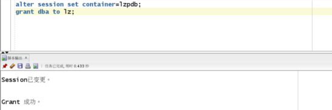

## 5.2 创建表空间
    在lzpdb数据库中创建了表空间lz_space1，表空间lz_space2,表空间lz_space3,表空间lz_space4（提示，先自己手动创建lzpdb这个文件夹）

``` sql
create tablespace 
lz_space1
datafile '/home/oracle/app/oracle/oradata/orcl/lzpdb/lz_space1.dbf' 
size 150M 
autoextend on next 50m
maxsize unlimited;
```
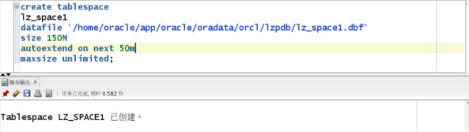
``` sql
create tablespace lz_space2 DATAFILE
'/home/oracle/app/oracle/oradata/orcl/lzpdb/lz_space2.bdf' SIZE 50M
AUTOEXTEND ON NEXT 5M MAXSIZE 100M;

create tablespace lz_space3 DATAFILE
'/home/oracle/app/oracle/oradata/orcl/lzpdb/lz_space3.bdf' SIZE 50M
AUTOEXTEND ON NEXT 5M MAXSIZE 100M;

create tablespace lz_space4 DATAFILE
'/home/oracle/app/oracle/oradata/orcl/lzpdb/lz_space4.bdf' SIZE 50M
AUTOEXTEND ON NEXT 5M MAXSIZE 100M;

```
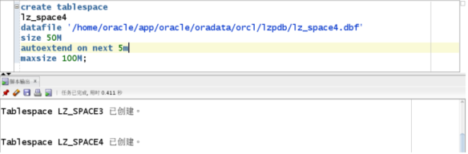

## 5.3 创建表以及将orders表进行分区
（1）创建分类表（class）

``` sql
create table class (
    class_id char(5) not null primary key,
    class_name char(10) not null,
    class_headperson char(15) not null
)TABLESPACE lz_space1;
``` 
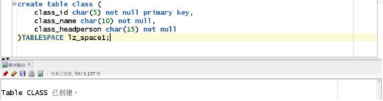
      
  


（2）创建商品表（commodity ）
``` sql
create table commodity (
    commodity_id char(5) not null primary key,
    commodity_name char(20) not null,
    commodity_price float not null CHECK(commodity_price > 0),
    commodity_sellprice float not null CHECK(commodity_sellprice > 0),
    class_id char(5),
    CONSTRAINT class_id_lz FOREIGN KEY (class_id) REFERENCES class (class_id)
)TABLESPACE lz_space1;
```
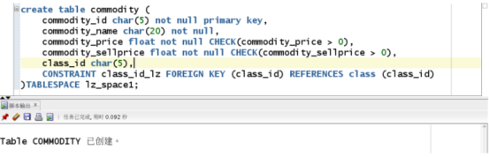


（3）创建商品表（customer）
``` sql
create table customer (
    customer_id char(5) not null primary key,
    customer_name char(10) not null,
    customer_sex char(15) not null,
    customer_phone char(11)
)TABLESPACE lz_space1;
``` 
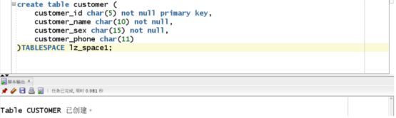


（4）创建导购员表（customer）
``` sql
create table shopGuide (
    shopguide_id char(5) not null primary key,
    shopGuide_name char(20) not null,
    shopGuide_sex char(2) not null check(shopGuide_sex in ('男','女')),
    shopGuide_brithday char(20) not null,
    shopGuide_entryTime char(20) not null,
    wages float not null CHECK(wages > 0),
    class_id char(5),
    CONSTRAINT class_id_lz2 FOREIGN KEY (class_id) REFERENCES class (class_id)
)TABLESPACE lz_space1;
```
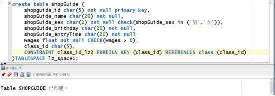


（5）创建库存表（stock）
``` sql
create table stock (
    stock_id char(5) not null primary key,
    commodity_id char(10) not null,
    size_ char(10),
    position_ char(20),
    store_info char(50),
    take_info char(50),
    CONSTRAINT stock_commodity_id FOREIGN KEY (commodity_id) REFERENCES commodity (commodity_id)
)TABLESPACE lz_space1;
```
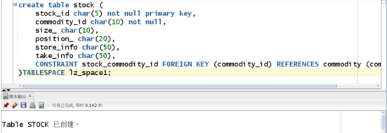


（6）创建订单表（stock），将订单的时间（order_date），进行分区，分别将2018年之前的数据放在表空间lz_space1, 将2019 到 2018年的数据放在了表空间lz_space2，将2020年 到 2019年的数据放在了表空间lz_space3,最后将大于2020年的数据放在了lz_spcae4里面。
``` sql

CREATE TABLE orders 
(
  order_id CHAR(10 BYTE) NOT NULL primary key, 
  order_info CHAR(50 BYTE) NOT NULL, 
  order_price FLOAT(126) NOT NULL,
  shopguide_id char(10),
  customer_id char(10),
  order_date date,
  CONSTRAINT order_shopguide_id FOREIGN KEY (shopguide_id) REFERENCES shopguide (shopguide_id),
  CONSTRAINT order_customer_id FOREIGN KEY (customer_id) REFERENCES customer (customer_id)
) partition by range (order_DATE)
  (
    partition p1 values LESS THAN (TO_DATE(' 2018-01-01 00:00:00', 'SYYYY-MM-DD HH24:MI:SS', 'NLS_CALENDAR=GREGORIAN')) tablespace lz_space1,

    partition p2 values LESS THAN (TO_DATE(' 2019-01-01 00:00:00', 'SYYYY-MM-DD HH24:MI:SS', 'NLS_CALENDAR=GREGORIAN')) tablespace lz_space2,

    partition p3 values LESS THAN (TO_DATE(' 2020-01-01 00:00:00', 'SYYYY-MM-DD HH24:MI:SS', 'NLS_CALENDAR=GREGORIAN')) tablespace lz_space3,
    
    partition p4 values LESS THAN (MAXVALUE) tablespace lz_space4
  )
```
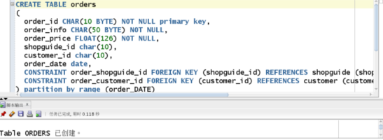

## 5.3 创建用户,授权,插入数据，以及对分区，授权的验证
### （1）分别创建两个用户lz_user1和lz_user2,并允许他们是使用lz_space1表空间

``` sql
create user lz_user1 IDENTIFIED by 123;
create user lz_user2 IDENTIFIED by 123;
alter user lz_user1 quota unlimited on lz_space1;
alter user lz_user2 quota unlimited on lz_space1;
```
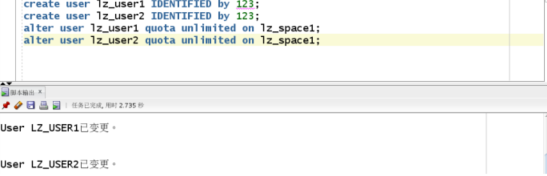


### （2）创建两个角色lz_role1，lz_role2，并分别赋予lz_role1读任何表和读，
lz_role2读任何表和读、修改任何表的权利；
``` sql
create role lz_role1;
create role lz_role2;
grant select any table to lz_role1;
grant select any table to lz_role2;
grant update any table to lz_role2;
```
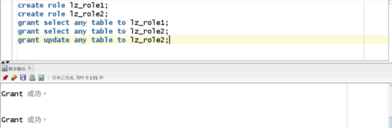


### （3）将lz_role1，lz_role2分别赋予给用户lz_user1，lz_user2
``` sql
grant lz_role1 to lz_user1;
grant lz_role2 to lz_user2;
```
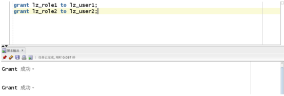


   
### （4）向表中插入数据：
``` sql
declare
    dt date;
    order_id char(10);
    order_info char(50);
    order_price float;
    shopguide_id char(5);
    customer_id char(5);
begin
    insert into class(class_id,class_name,class_headperson) values ('1','男装','卢峥');
    insert into class(class_id,class_name,class_headperson) values ('2','女装','卢峥');
    insert into class(class_id,class_name,class_headperson) values ('3','童装','卢峥');
    
    Insert into commodity(commodity_id,commodity_name,commodity_price,commodity_sellprice,class_id) values ('101','男上衣',20,30,'1');
    insert into commodity(commodity_id,commodity_name,commodity_price,commodity_sellprice,class_id) values ('102','男裤子',15,25,'1');
    insert into commodity(commodity_id,commodity_name,commodity_price,commodity_sellprice,class_id) values ('103','女上衣',15,25,'2');
    insert into commodity(commodity_id,commodity_name,commodity_price,commodity_sellprice,class_id) values ('104','女裤子',25,35,'2');
    insert into commodity(commodity_id,commodity_name,commodity_price,commodity_sellprice,class_id) values ('105','儿童上衣',10,20,'3');
    insert into commodity(commodity_id,commodity_name,commodity_price,commodity_sellprice,class_id) values ('106','儿童裤子',10,20,'3');
    
    insert into shopguide(shopguide_id,shopguide_name,shopguide_brithday,shopguide_sex,shopguide_entrytime,wages,class_id) 
    values ('1','卢峥','0505','男','0101',1000,'1');
    
    insert into customer(customer_id,customer_name,customer_sex,customer_phone) values ('1','卢峥','男','15516102919');
    
    for i in 1..50000
    loop
        if i mod 3=0 then
        dt := to_date('2018-01-01','yyyy-mm-dd')+(i mod 60);
    --PARTITION_2018
        elsif i mod 6 = 1 then
        dt := to_date('2019-01-01','yyyy-mm-dd')+(i mod 60);
    --PARTITON_2019
        elsif i mod 6 = 2 then
        dt := to_date('2020-01-01','yyyy-mm-dd')+(i mod 60);
    --PARTITION_2020
        end if;
    --开始向order表里插入数据
        order_id := i;
        customer_id := '1';
        shopguide_id := '1';
        order_info := '订单详情';
        order_price := dbms_random.value(5,30);
        
        insert into orders (order_id,order_info,order_price,customer_id,shopguide_id)
        values (order_id,order_info,order_price,customer_id,shopguide_id);
        
    end loop;
end;
```
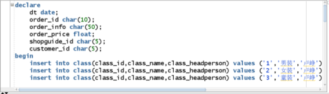


### （5）之前创建了两个用户，一个是lz_user1,一个是lz_user2，并且给lz_user1和lz_user2分别授予了查看表，查看表以及更新表的权限，接下来进行验证：
    给用户lz_user1,lz_user2授权链接
``` sql
grant connect to lz_user1;
grant connect to lz_user2;
```
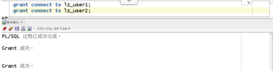

    首先，让lz_user1连接数据库lzpdb,让其查看lz的ORDER表，如下图所示，是可以看见的。
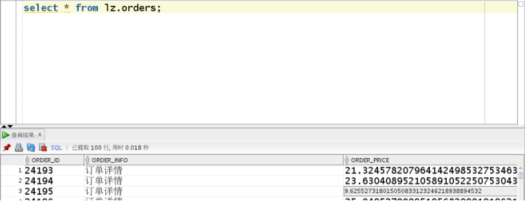


    然后，让lz_user1更新一条数据，会发现其权限不足，由此可以证明，授权成功。
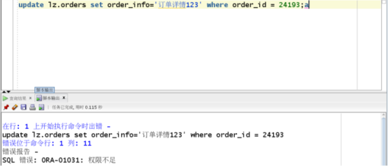

    接着对lz_user2(之前赋予了更新和查看权限）用户查看和更新lz的ORDERS表，发现均成功，但让其删除一条记录是会显示权限不足，由此可证明，授权无误。
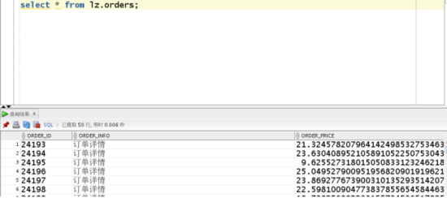
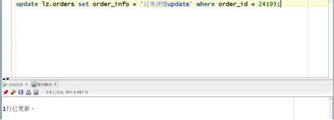
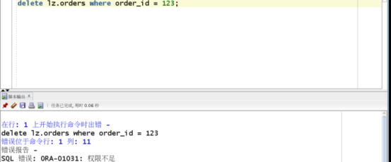

（6）根据REGISTRATION_FORM表中的REGISTRATION_DATE字段根据时间段的不同，将其放在了不同的表空间里面，由下图可知，每个表空间里面均有REGISTRATION_FORM的数据，也可证明分区成功。
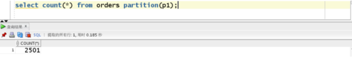
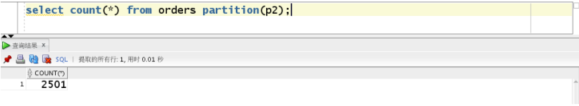
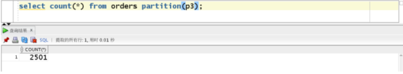
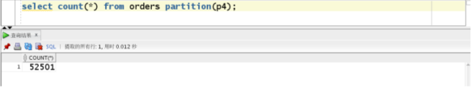


# 第六章程序包的建立
    建立一个程序包，里面有一个函数和一个存储过程，其功能分别为：统计一段时间内的订单总收入；统计一段时间内，各个导购员的接待数。具体过程如下：

``` sql
create or replace PACKAGE MyPack is
    function get_total(dt1 char,dt2 char) return number;
    procedure get_people(dt1 char,dt2 char);
END MyPack;
/
create or replace PACKAGE BODY MyPack is
function get_total(dt1 char,dt2 char) return number
    AS
        n number;
        begin
            select sum(order_price) into n from orders where order_date >=to_date(dt1,'yyyy-mm-dd hh24:mi:ss')
            and order_date<=to_date(dt2,'yyyy-mm-dd hh24:mi:ss');
        return n;
    end;

procedure get_people(dt1 char,dt2 char)
    AS
        a number;
        b number;
        cursor people is
            select * from orders where order_date>= to_date(dt1,'yyyy-mm-dd hh24:mi:ss')
            and order_date<= to_date(dt2,'yyyy-mm-dd hh24:mi:ss');
        begin
            a:=0;
            b:=0;
            for v in people
            loop
                if v.shopguide_id = '1'
                    then a:= a+1;
                elsif v.shopguide_id = '2'
                    then b:= b+1;
                end if;
            end loop;
            dbms_output.put_line('导购员卢峥接待客户数为:'|| a);
            dbms_output.put_line('导购员pp接待客户数为:'||b);
    end;
END MyPack;

```
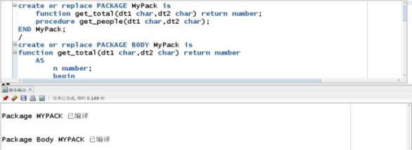

    接下来是效果展示：
    
    函数效果展示
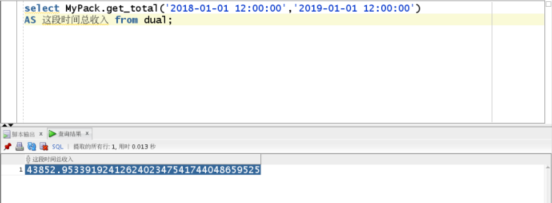


    存储过程效果展示
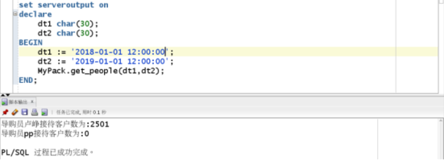


# 第七章系统定时自动备份
## （1）编写rman增量备份脚本

``` sql
#rman_level1.sh 
#!/bin/sh
    export NLS_LANG='SIMPLIFIED CHINESE_CHINA.AL32UTF8'
    export ORACLE_HOME=/home/oracle/app/oracle/product/12.1.0/dbhome_1  
    export ORACLE_SID=orcl  
    export PATH=$ORACLE_HOME/bin:$PATH  
    rman target / nocatalog msglog=/home/oracle/rman_backup/lv1_`date +%Y%m%d-%H%M%S`_L0.log << EOF
    run{
    configure retention policy to redundancy 1;
    configure controlfile autobackup on;
    configure controlfile autobackup format for device type disk to '/home/oracle/rman_backup/%F';
    configure default device type to disk;
    crosscheck backup;
    crosscheck archivelog all;
    allocate channel c1 device type disk;
    backup as compressed backupset incremental level 1 database format '/home/oracle/rman_backup/dblv1_%d_%T_%U.bak'
    plus archivelog format '/home/oracle/rman_backup/arclv1_%d_%T_%U.bak';
    report obsolete;
    delete noprompt obsolete;
    delete noprompt expired backup;
    delete noprompt expired archivelog all;
    release channel c1;
}
EOF

exit
```


## （2）启动linux的crontab定时任务，每天的凌晨一点自动进行备份


## （3）演示备份与恢复：

### （3.1）执行rman_level1.sh脚本，进行数据库备份

### （3.2）破坏数据库
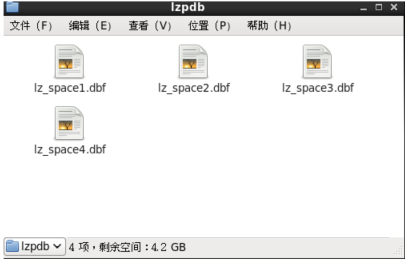
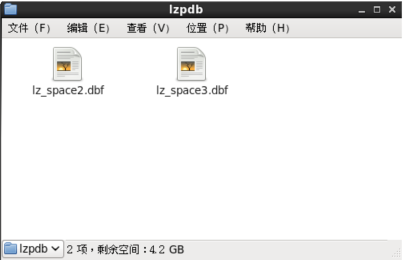
### （3.3）启用rman，进行数据库恢复
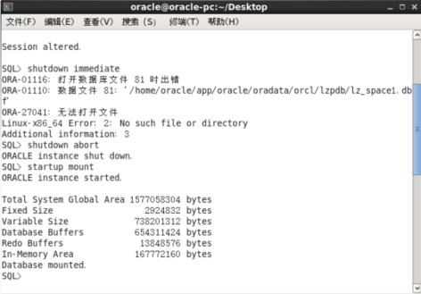
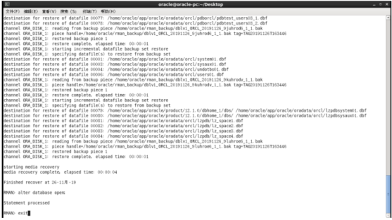

### （3.4）查看删除的是否恢复
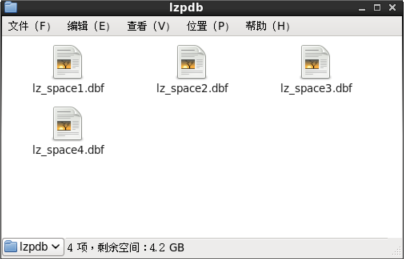
### （3.5）恢复成功

